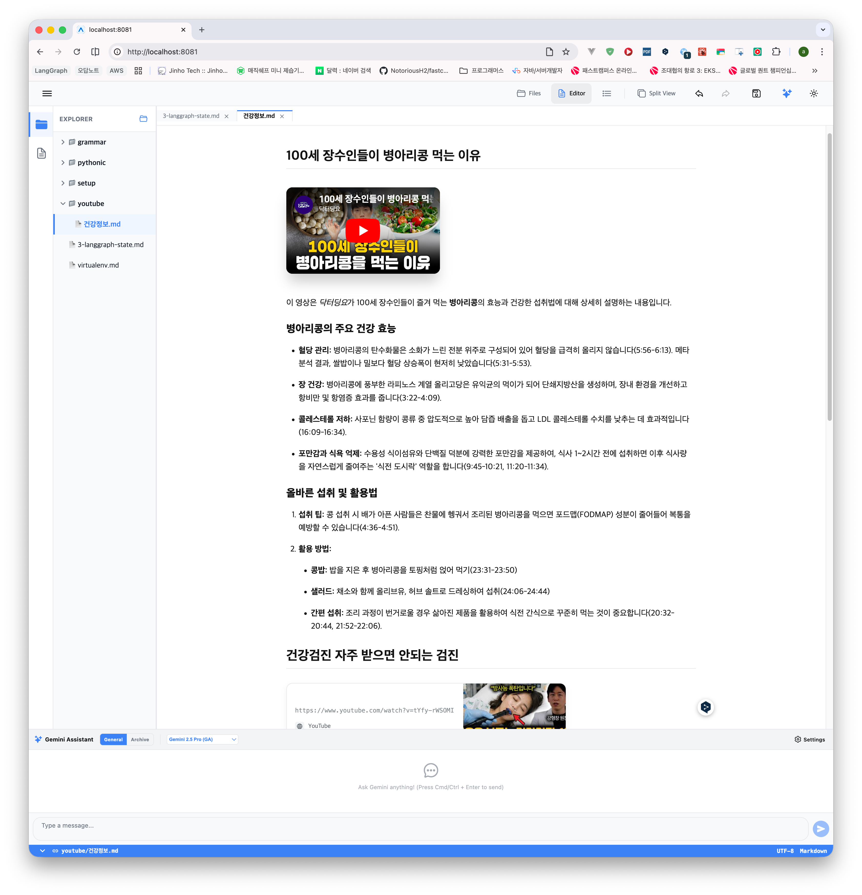

아래 문서들과 테스트 코드들을 통해 제품의 주요 기능들을 파악하세요.
- 프로젝트 최상단의 README.md
- docs/product 내의 feature 문서들 (errors 제외)

그리고 이 내용들과 아래 요소들을 참고해서 제품을 소개하기 위한 홍보용 html 웹페이지를 만들기 위한 프롬프트를 바로 아래의 '### 프롬프트' 섹션에 작성하세요. 위의 내용들은 수정하거나 삭제하지 마세요.

주요 특징
- 비영리목적의 마크다운 편집기 + 탐색기 (개인/기업 누구든 자유롭게 사용 가능)
- 모바일(안드로이드/IOS) 및 PC(windows/mac/linux) 모두 지원
- dark mode 지원
- 플러그인 기반 add on 기능 (to be soon)
- AI (e.g. Gemini) 연계 기능 (to be soon)
- Typora 의 로컬 탐색기 + 편집기능, VSCode 의 탭/분할 화면편집 기능, Obsidian 의 마크다운 미리보기 기능, 원하는 디렉터리의 Nextra Export 기능을 지원하는 다목적 애플리케이션
- Youtube link 의 썸네일 모드 지원
- 일반 페이지의 Card 형태의 thumbnail preview 지원
- 멀티탭 지원, 탭 분할 보기 지원

사용 사례
- e.g. 안드로이드 폰의 마크다운 파일들을 편리하게 관리하고 편집하기 위한 에디터
- e.g. 건강정보 유튜브 영상들 의 내용을 마크다운 파일 내에 기록할수 있는 마크다운 + 탐색기 
- e.g. 유튜브 재생목록 대신 텍스트 파일 기반으로 주요 정보성 youtube 영상들을 주제별 스크랩 및 요약,정리하는 용도
- e.g. 구글 드라이브 연동된 디렉터리내의 마크다운 파일들을 편리하게 관리하고 편집하기 위한 에디터
- e.g. ICloud 연동된 디렉터리내의 마크다운 파일들을 편리하게 관리하고 편집하기 위한 에디터
- e.g. 등산 후 느꼈던 맑은 정신과 그 당시의 바이브를 마크다운 문서로 기록하기
- e.g. 블로그/x/인스타에 기록하기엔 일기성격 인 요소의 일상을 기록 (등산 경험 등등)
- e.g. 소셜 플랫폼에 기록하기에는 추후 백업을 언제할지에 대한 부담감이 있는 문서작업일 경우

지침
- '사용 사례' 를 친절하게 설명하는 섹션을 별도로 포함하세요.
- 프로젝트 최상단의 toc_demo.png 의 테마에 부합하도록 소개페이지를 디자인하세요.
- 다크모드 역시 지원되도록 하세요.
-  를 참고하세요.
-  를 참고하세요.

### 프롬프트

**[Objective]**
'Mark Explorer'라는 프리미엄 마크다운 에디터 및 탐색기 제품을 홍보하기 위한 고퀄리티, 모던 감성의 단일 페이지 HTML 웹사이트를 제작해 주세요. 이 페이지는 잠재 사용자들에게 제품의 강력한 기능과 세련된 디자인을 시각적으로 매력 있게 전달해야 합니다.

**[Design Concept & Aesthetics]**
1. **Premium Modern UI**: 애플이나 노션(Notion) 스타일의 깔끔하고 고급스러운 레이아웃을 지향합니다.
2. **Dual Theme Support**: 
   - **Light Mode**: `#ffffff` 배경에 `#3b82f6`(Gemini Blue) 포인트를 사용한 신뢰감 있고 깨끗한 느낌.
   - **Dark Mode**: `#0b0e14`(Obsidian Black) 배경에 `#7c3aed`(Violet) 포인트와 글래스모피즘(Glassmorphism) 효과를 적용한 세련된 느낌.
3. **Typography**: 'Inter' 또는 'Outfit' 같은 현대적인 산세리프 폰트를 사용하여 가독성과 전문성을 높여주세요.
4. **Visual Elements**:
   - 부드러운 스크롤 애니메이션과 마우스 호버 효과(Micro-interactions).
   - 카드 기반 레이아웃과 적절한 여백(White Space) 활용.
   - `toc_demo.png` 테마의 정교한 정렬과 전문적인 도구 느낌을 반영하세요.

**[Key Features to Highlight]**
1. **Multi-Platform Power**: PC(Windows, Mac, Linux)부터 모바일(iOS, Android)까지 완벽 지원. 언제 어디서나 동일한 환경의 마크다운 편집.
2. **Hybrid Workflow**:
   - **Typora의 직관성**: 실시간 라이브 편집(Live Editor).
   - **VSCode의 효율성**: 멀티탭 지원 및 2x2 분할 화면 편집.
   - **Obsidian의 깊이**: 스마트 TOC(목차) 및 미리보기 모드.
   - **Nextra의 확장성**: 로컬 디렉터리를 단 한 번의 클릭으로 정적 사이트로 익스포트.
3. **Smart Media Integration**: 
   - 일반 링크를 Notion 스타일의 **Thumbnail Card**로 자동 변환.
   - 유튜브 링크의 **영상 썸네일 모드** 및 인앱 재생 지원.
4. **Next-Gen Tech (Coming Soon)**:
   - **AI Context Engine**: Gemini AI를 통한 문서 요약 및 MCP를 활용한 외부 도구 연동.
   - **Plugin Ecosystem**: 사용자 정의 기능을 추가할 수 있는 플러그인 아키텍처.

**[Use Cases - "친절한 설명" 섹션]**
사용자가 'Mark Explorer'를 어떻게 활용할 수 있는지 직관적인 시나리오로 보여주세요:
- **Mobile Manager**: 이동 중에도 스마트폰에서 로컬 마크다운 파일을 손쉽게 관리하고 편집.
- **YouTube Content Curator**: 학습용 유튜브 영상의 내용을 마크다운으로 기록하고 썸네일로 시각화하여 요약 정리.
- **Privacy-First Journaling**: 클라우드 의존 없이 로컬(또는 Google Drive/iCloud 연동)에 나만의 소중한 일상과 등산 기록을 안전하게 보관.
- **Content Creator's Toolkit**: 백업 걱정 없는 텍스트 기반의 지식 베이스 구축.

**[Layout Structure]**
1. **Hero Section**: 강력한 슬로건과 함께 제품의 가치를 한눈에 보여주는 화려한 메인 비주얼.
2. **Feature Grid**: 주요 기능들을 아이콘과 함께 명확하게 설명하는 그리드 섹션.
3. **Use Case Showcase**: '사용 사례'를 스토리텔링 방식으로 친절하게 설명하는 섹션.
4. **Platform & Tech**: 지원 기기 및 사용된 기술 스택(Tiptap, Expo 등) 소개.
5. **Call to Action**: 무료로 시작하기 및 GitHub 링크 안내.

**[Reference Guidance]**
- 전체적인 디자인 톤앤매너는 첨부된 `brochure2-20260426-1.png` 및 `brochure2-20260426-2.png`의 레이아웃과 심미성을 참고하여, 훨씬 더 프리미엄하고 완성도 있게 구현하세요.
- 접근성(Accessibility)과 모바일 반응형(Responsive Design)을 완벽하게 준수하세요.
- 모든 이미지는 실제 제품의 스크린샷이 들어갈 자리를 placeholder나 고급스러운 일러스트로 채워주세요.

 

### Command
바로 위의 '### 프롬프트' 섹션에 작성된 프롬프트를 기반으로 ./brochure2.html 에 홍보용 웹페이지를 생성하세요. 위의 내용들은 수정하거나 삭제하지 마세요.
