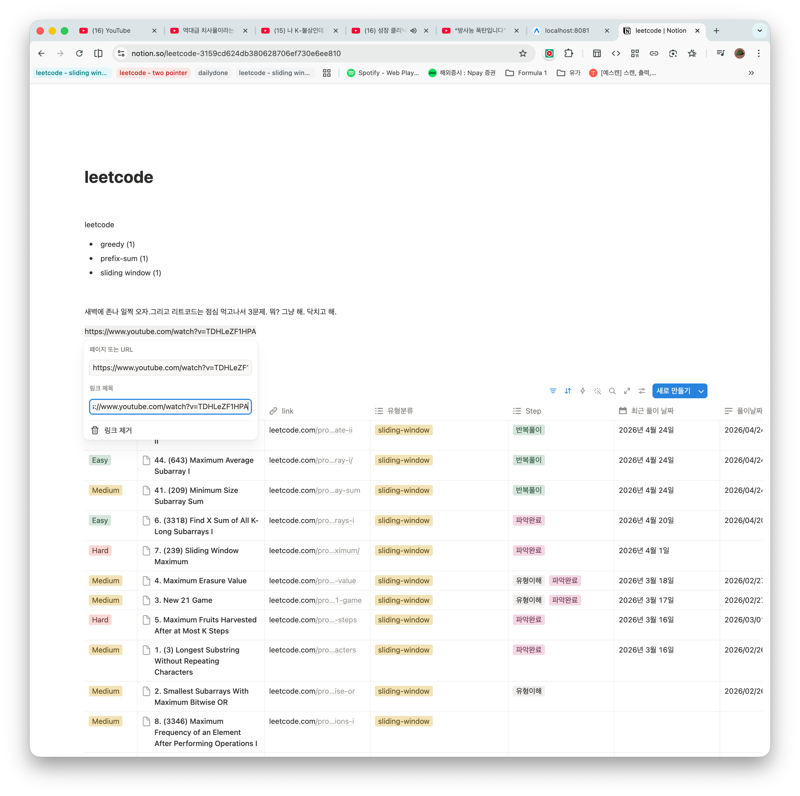

## Q
그림2
- 
- 


http, https 에 대한 링크노드가 Link Type 일 경우에 첨부한 그림과 같은 노션의 Link 추가 기능과 유사한 기능을 추가하려고 합니다. 첫번째 사진은 Link Node 로 인식되어 있는 상태에서 마우스 오버시의 동작입니다. 두번째 사진은 편집 버튼을 클릭했을 때의 동작입니다.

이 UI, 이벤트 로직을 만들기 위한 프롬프트를 만들어주세요. 현재 프로젝트의 색상 조합과 분위기에 맞도록 UI 스타일, 색상 조합, UI 조합에 대해 프롬프트내에 정의하세요.

### A
Listed directory markdown-explorer-v1
Viewed design-ux-style-v1.md
Listed directory constants
Viewed theme.ts:1-54
Viewed package.json:1-139
Listed directory components
Listed directory ui
Viewed Editor.web.tsx:1-800
Viewed LinkCardExtension.tsx:1-51
Viewed LinkCardComponent.tsx:1-336
Viewed MarkdownUtils.ts:1-154
Viewed Editor.web.tsx:801-1000
Viewed Editor.web.tsx:1200-1460
Viewed Editor.web.tsx:540-640

제공해주신 Notion의 링크 편집 기능(호버 시 툴바, 클릭 시 팝업 편집창)을 프로젝트의 디자인 시스템과 분위기에 맞춰 구현하기 위한 **상세 구현 프롬프트**를 작성해 드립니다.

현재 프로젝트의 `Editor.web.tsx`와 `LinkCardComponent.tsx`의 코드를 분석한 결과, 이미 노드 기반의 링크 처리 로직이 일부 존재하므로, 이를 **프리미엄 UI(Glassmorphism, 고도화된 그림자 및 애니메이션)**로 업그레이드하고 **이벤트 로직을 정교화**하는 방향으로 구성했습니다.

---

### 🎨 디자인 및 구현을 위한 통합 프롬프트

````markdown
# Task: Notion-style Link Hover & Edit UI Implementation

## 1. 개요
Tiptap 에디터 내의 `http`, `https` 링크(Node 기반의 LinkCard)에 대해 Notion과 유사한 사용자 경험을 제공하는 호버 툴바와 편집 팝업 UI를 구현하세요. 프로젝트의 'Rich Aesthetics' 가이드라인에 따라 유리 질감(Glassmorphism)과 세련된 애니메이션을 적용해야 합니다.

## 2. 디자인 시스템 및 색상 조합 (Project Atmosphere)
현재 프로젝트의 테마를 반영하여 다음 스타일 가이드를 준수하세요:
- **폰트**: 기본 UI는 `Inter, sans-serif`, URL 표시 영역은 `JetBrains Mono` 또는 `monospace`.
- **색상 (Light Mode)**:
  - 배경: `rgba(255, 255, 255, 0.85)` (백드롭 블러 적용)
  - 테두리: `#E5E7EB` (Subtle gray)
  - 강조색: `#3B82F6` (Markdown Explorer Blue)
  - 텍스트: `#11181C` (Main), `#687076` (Muted)
- **색상 (Dark Mode)**:
  - 배경: `rgba(21, 23, 24, 0.85)` (백드롭 블러 적용)
  - 테두리: `#374151`
  - 강조색: `#3B82F6`
  - 텍스트: `#ECEDEE` (Main), `#9BA1A6` (Muted)
- **효과**: 
  - `backdrop-filter: blur(12px)`
  - `box-shadow: 0 10px 25px -5px rgba(0, 0, 0, 0.1), 0 8px 10px -6px rgba(0, 0, 0, 0.1)`
  - `border-radius: 8px`

## 3. UI 구성 및 컴포넌트 상세
### A. Hover Toolbar (상태: `isHovered && !isEditing`)
- **구성**: [아이콘(Link)] + [URL(Truncated)] + [복사 버튼] + [편집 버튼("편집")]
- **아이콘**: `@expo/vector-icons`의 `Ionicons` 사용 (`link-outline`, `copy-outline`, `create-outline`)
- **상호작용**: 링크 노드 위에 마우스를 올리면 링크 상단 또는 하단에 부드럽게 나타남 (Fade-in 효과).

### B. Edit Popup (상태: `isEditing`)
- **레이아웃**: 수직 스택 구조의 카드 형태.
- **입력 필드**: 
  1. "페이지 또는 URL": 현재 URL 수정용.
  2. "링크 제목": 링크 텍스트(alt) 수정용.
  - 필드 라벨은 작고 연하게 표시하며, 포커스 시 테두리에 강조색(`#3B82F6`) 적용.
- **푸터**: 
  - 왼쪽: "링크 제거" 버튼 (빨간색 `#EF4444`, 휴지통 아이콘).
  - 오른쪽: "취소" (Ghost 스타일), "저장" (Primary 스타일, 배경색 `#3B82F6`, 흰색 글자) 버튼 배치.

## 4. 이벤트 및 상태 로직
- **Hover Logic**: `onMouseEnter`, `onMouseLeave`를 사용하여 툴바 노출 여부 제어. 마우스가 툴바로 이동할 때 사라지지 않도록 브릿지 영역이나 `pointer-events` 처리.
- **Edit Logic**: "편집" 버튼 클릭 시 팝업을 열고 에디터의 포커스를 차단. `Esc` 키 또는 외부 클릭 시 팝업 닫기.
- **Update Logic**: "저장" 클릭 시 Tiptap의 `updateAttributes`를 호출하여 `url`과 `alt` 속성을 동기화.
- **Remove Logic**: "링크 제거" 클릭 시 해당 노드를 삭제하고 일반 텍스트로 변환하거나 범위를 제거.

## 5. 기술적 요구사항
- `ReactNodeViewRenderer`를 사용하는 `LinkCardComponent.tsx`를 고도화할 것.
- `Framer Motion` 또는 `CSS Transitions`를 사용하여 팝업이 나타날 때 미세한 스케일 업 애니메이션을 추가할 것.
- 반응형을 고려하여 모바일 사이즈에서는 팝업의 너비가 조절되도록 구현할 것.
````

---

### 💡 추가 팁
이 프롬프트를 사용하여 작업을 진행하실 때, 기존의 `LinkCardComponent.tsx` 파일 내용을 참고하도록 하면 AI가 훨씬 정확하게 기존 로직과 통합된 코드를 작성해 줄 것입니다. 특히 **Glassmorphism** 효과를 위해 `backdrop-filter`와 `rgba` 배경색을 강조하면 현대적이고 프리미엄한 느낌의 UI를 얻으실 수 있습니다.

