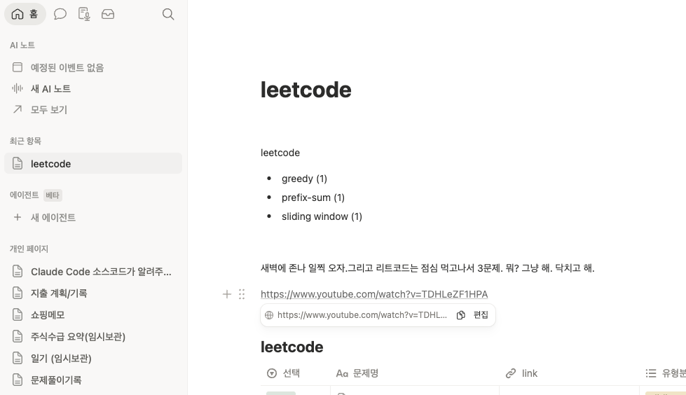
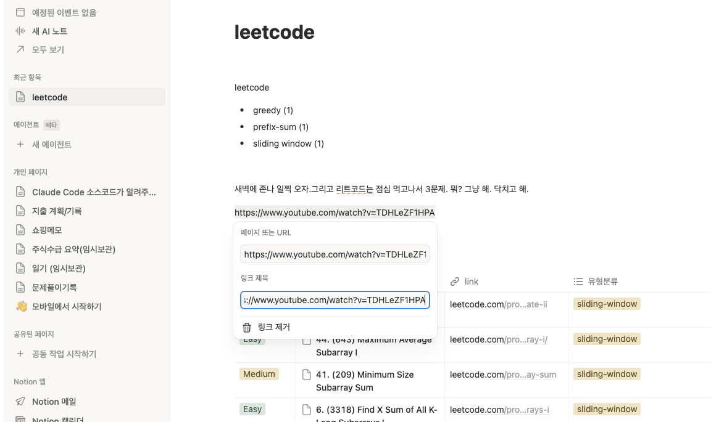

Plain Type : https://www.youtube.com/watch?v=gHG4d_KLeXU
Link Type : [mx-link#(수면용) 봐서 하등 도움 될 거 없는 2시간짜리 초 고칼로리 음식 여행](https://www.youtube.com/watch?v=gHG4d_KLeXU)
Thumbnail Type : [mx-thumb#수면용) 봐서 하등 도움 될 거 없는 2시간짜리 초 고칼로리 음식 여행](https://www.youtube.com/watch?v=gHG4d_KLeXU)

 

이런 형태를 지원하려고 하며, http://, https 로 시작하는 링크 영역에 대해 Plain Type, Link Type, Thumbnail Type 으로 전환하게 해주는 버튼이 있어야 합니다. URL 로 판별하는 기준은 http:// 로 시작해서 공백이 발생하기 바로 전까지를 URL로 판별합니다. 처음 URL 을 북사해서 붙여넣었을때 http://, https:// 로 시작하는지, 공백이 나타나기 전까지의 http://abc.com 형태의 url 을 url 노드로 인식해서 마우스 오버 시에 url 노드의 우측 상단에 Thumbnail Type, Link Type, Plain Type 을 선택하는 아이콘일 표시해서 선택할수 있도록 해주세요. 
 

만약 처음 마크다운 파일을 열었을 때 http://abc.com 과 같은 url 이 있을 경우 [mx-thumb#{alt}](url) 인지 [mx-link#{alt}](url) 인지 여부에 따라 Thumbnail 타입, Link 타입인지를 판단하며,  형태가 아닌 plain text 일 경우에는 Plain Type 으로 인식합니다. 
 

- 첨부 1: 
- 첨부 2: 
Link Type 의 경우 링크 위에 마우스 오버 시에 첫번째 첨부 사진과 유사한 형태의 메뉴가 나와야 하며, 링크를 수정할수 있어야 하며, 링크를 복사할 수도 있어야 합니다. 편집 버튼을 누르면 두번째 그림 처럼 alt text, link  를 수정해야 합니다. 이 때 alt text 를 수정하더라도 mx-link# 접두사는 변하지 않도록 해야 합니다. 
 

