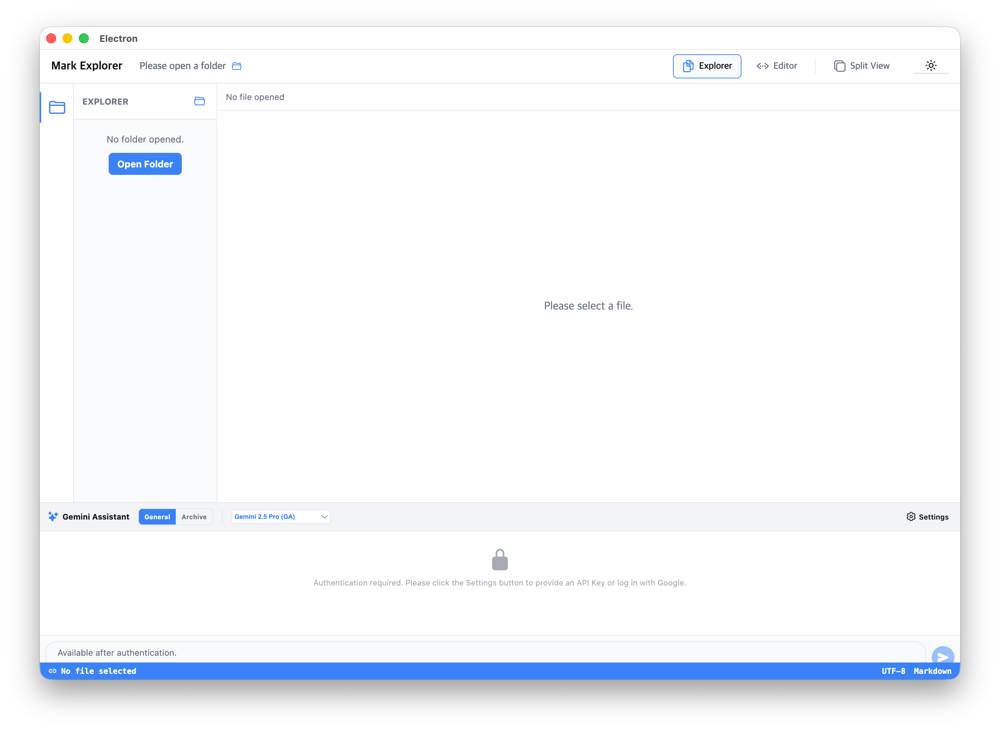

## (1)
### 증상

데스크탑 버전에서 Gemini Chatting 패널의 토글 버튼이 보이지 않습니다. 이 문제를 해겨랗기 위한 프롬프트를 작성하고, 이 프롬프트에 의거해 문제를 해결하세요. plan1.md, goal1.md 에 문제 해결계획과 결과를 기록하세요.  

바로 아래의 '### 프롬프트' 섹션에 프롬프트를 작성하세요. 

### 프롬프트
현재 데스크탑(Electron) 환경에서 Gemini Chatting 패널을 토글할 수 있는 버튼이 UI상에 나타나지 않는 문제가 발생하고 있습니다. 이 문제를 해결하기 위해 다음 사항을 확인하고 수정해 주세요:

1. `app/index.tsx`와 `components/layout/Footer.tsx`, `components/layout/Header.tsx` 파일을 분석하여 Gemini Chatting 패널을 토글하는 로직(`toggleFooter`)과 연결된 버튼이 데스크탑 환경에서 정상적으로 렌더링되고 있는지 확인하세요.
2. 특히 `Footer.tsx` 하단의 `footerPath` 영역에 있는 토글 버튼(`chevron-up`/`chevron-down`)이나 `Header.tsx`에 있는 Gemini 버튼(`sparkles`)이 데스크탑 레이아웃에서 가려지거나 렌더링 조건에 의해 누락되었는지 점검하세요.
3. 데스크탑 버전(`Platform.OS === 'web'` 및 Electron 환경)에서 사용자가 명확하게 Gemini 패널을 열고 닫을 수 있도록 토글 버튼의 가시성을 확보하고, 필요하다면 스타일을 조정하여 UI 요소가 겹치지 않도록 하세요.
4. 수정 사항이 적용된 후, 데스크탑 환경에서 Gemini Chatting 패널이 정상적으로 토글되는지 확인하는 코드를 작성하거나 확인 절차를 거치세요.

