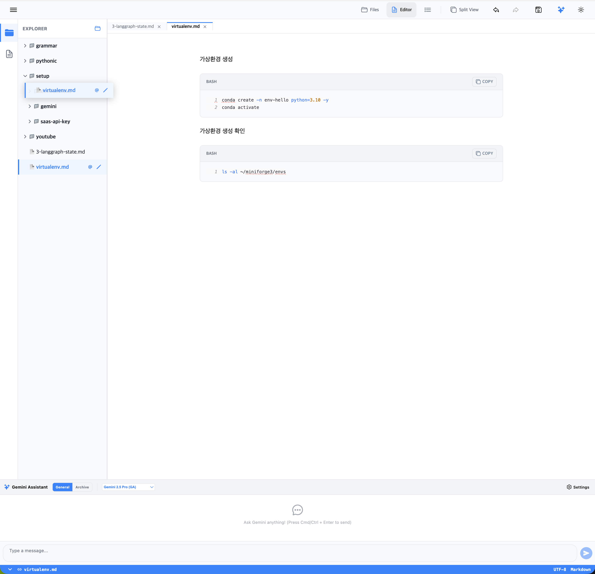

## 증상

첨부한 그림과 같이 드래그앤 드랍으로 특정 파일을 다른 폴더로 이동시키는 기능이 현재 동작하지 않습니다. 이 것을 해결하기 위한 프롬프트를 아래의 '### 프롬프트' 섹션에 작성하세요. 위의 '#### 증상' 섹션의 내용을 지우거나 수정하지 마세요.

#### 프롬프트

현재 파일 익스플로러에서 드래그 앤 드랍을 이용한 파일 이동 기능이 동작하지 않습니다. 이 문제를 해결하기 위해 다음의 단계별 구현을 수행하세요.

### 1. `useFileSystem.ts` 후크에 `moveItem` 함수 추가
- **기능**: 특정 파일이나 디렉토리를 대상 디렉토리로 이동시키는 `moveItem` 함수를 구현합니다.
- **플랫폼 대응**:
  - **Web (File System Access API)**: `FileSystemHandle.move()`를 사용하거나, 지원되지 않는 환경에서는 `copyDirectoryRecursive`를 활용해 복사 후 원본을 삭제(delete)하는 방식을 사용하세요.
  - **Native (Storage Access Framework / Legacy)**: `expo-file-system`의 `moveAsync` 또는 SAF API를 사용하여 이동을 처리하세요.
- **상태 업데이트**: 이동 성공 후 `fileSystemData`, `localFiles`, `openedFiles`, `selectedFile` 등 모든 관련 상태를 새로운 경로에 맞게 업데이트해야 합니다. (기존 `renameItem`의 경로 업데이트 로직을 참고하세요.)

### 2. `FileExplorer.tsx` 및 `FileTree.tsx` 수정
- `onMove` 콜백을 프롭스(Props)로 추가하고, 이를 최하위 `FileItem`까지 전달합니다.

### 3. `FileItem.tsx` 드래그 앤 드랍 로직 구현 (Web 전용)
- **드래그 가능 설정**: 파일(`kind === 'file'`)뿐만 아니라 디렉토리(`kind === 'directory'`)도 드래그가 가능하도록 `draggable` 속성을 설정하세요.
- **드랍 대상 처리**: `kind === 'directory'`인 아이템에 `onDragOver`와 `onDrop` 핸들러를 추가합니다.
  - `onDragOver`: 기본 동작을 방지(`e.preventDefault()`)하여 드랍이 가능하게 하고, 드랍 가능 여부를 시각적으로 표시(예: 배경색 변경)하세요. 자기 자신이나 자신의 하위 폴더로 이동하는 것은 방지해야 합니다.
  - `onDrop`: 드래그된 아이템의 경로를 가져와 `onMove(draggedPath, targetDirectoryPath)`를 호출합니다.

### 4. `app/index.tsx`에서 전체 로직 연결
- `useFileSystem`에서 제공하는 `moveItem`을 호출하는 `handleMoveFileSystem` 핸들러를 만듭니다.
- 이 핸들러를 `FileExplorer`의 `onMove` 프롭스로 전달합니다.
- 이동 완료 후 사용자에게 성공 알림(Toast 또는 Alert)을 표시하고, 필요한 경우 대상 폴더를 확장(`expandedFolders`) 상태로 변경하세요.

모든 코드는 프로젝트의 기존 코딩 스타일(TypeScript, Functional Components, StyleSheet)을 준수하며, 특히 한국어 파일명 처리를 위한 `decodeURIComponent` 등의 유틸리티를 적절히 활용해야 합니다.

