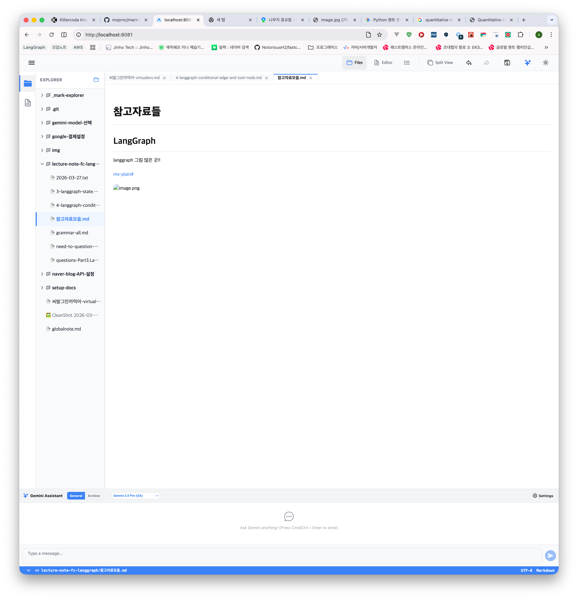

## 증상1

Editor 모드에서 이미지 업로드 후 저장한 다음에 Explorer 모드로 전환하면 업로드한 파일이 정상적으로 노출되지 않습니다. 
 

이 요구사항을 풀기 위한 prompt 를 바로 아래의 ## 프롬프트에 작성해주세요. 현재 ## 증상 내의 내용들은 수정하거나 삭제하지 마세요.

### 프롬프트

#### 제목: 이미지 업로드 후 익스플로러(미리보기) 모드 이미지 출력 로직 강화

**목표**: 에디터에서 이미지를 업로드하거나 붙여넣어 생성된 상대 경로(예: `./img/...`)가 익스플로러(미리보기) 모드에서도 정확하게 실제 이미지로 렌더링되도록 수정합니다.

**요구사항**:

1.  **MarkdownPreview.web.tsx (img 태그 매퍼) 수정**:
    *   `img` 컴포넌트의 `useEffect` 내에서 `resolveImage` 핸들러가 호출되는 조건을 확인하세요.
    *   상대 경로(데이터 URL, 외부 HTTP가 아닌 경로)인 경우 반드시 `resolveImage`를 통해 로컬 파일의 실제 `blob:` URL을 가져오도록 보장하세요.
    *   `resolveImage`가 변경되거나 `src`가 변경될 때마다 이미지를 다시 해석하도록 의존성 배열을 업데이트하세요.

2.  **EditorWorkspace.tsx (resolveImage 핸들러) 안정화**:
    *   미리보기 모드에 전달되는 `resolveImage` 핸들러가 최신 로컬 파일 상태를 반영할 수 있도록 `useMemo` 또는 `useCallback`으로 안정화되어 있는지 확인하세요.

3.  **경로 해석 유연성**:
    *   이미지 경로 앞에 `./`가 붙어 있거나 없는 경우 등 다양한 상대 경로 형식을 `resolveImage`가 정확히 인지하여 로컬 파일 목록에서 찾아낼 수 있도록 하세요.

**검증 방법**:
- 에디터 모드에서 이미지를 붙여넣기(Paste)하여 업로드합니다.
- 파일을 저장(`Cmd+S`)합니다.
- 상단 탭에서 'Files'(Explorer 모드)로 전환합니다.
- 결과: 업로드했던 이미지가 엑박 없이 정상적으로 화면에 출력되어야 합니다.

## 증상2
수정중인 마크다운 파일이 한글 또는 비영어권 언어일 경우 이미지 업로드 후 Explorer(미리보기) 모드에서 정상적으로 해당 이미지가 노출되지 않는 이슈가 있습니다.

이 요구사항을 풀기 위한 prompt 를 바로 아래의 ## 프롬프트에 작성해주세요. 현재 ## 증상 내의 내용들은 수정하거나 삭제하지 마세요.

### 프롬프트

#### 제목: 한글 및 비영어권 파일명의 이미지 경로 해석 문제 해결

**목표**: 마크다운 파일명이 한글이거나 경로에 비영어권 문자가 포함된 경우에도 익스플로러(미리보기) 모드에서 이미지가 정상적으로 출력되도록 경로 해석 로직을 강화합니다.

**요구사항**:

1.  **useFileSystem.ts (resolveImage) 수정**:
    *   마크다운 텍스트에서 추출된 이미지 경로(`src`)가 URL 인코딩되어 있을 가능성에 대비하여, 경로를 파일 시스템 핸들과 매칭하기 전에 반드시 `decodeURIComponent`를 적용하세요.
    *   인코딩된 문자열(예: `%ED%85%8C%EC%8A%A4%ED%8A%B8`)과 실제 파일 핸들의 이름(`테스트`)이 정확히 일치하도록 보장해야 합니다.

2.  **경로 정규화 과정 점검**:
    *   `normalizePath` 이후에 디코딩을 수행하여, 정규화된 경로 내의 특수 문자나 유니코드가 깨지지 않고 보존되도록 하세요.
    *   디렉토리 핸들을 순차적으로 가져올 때(`getDirectoryHandle`) 디코딩된 이름을 사용하도록 하세요.

**검증 방법**:
- 파일명을 '한글테스트.md'와 같이 한글로 생성합니다.
- 해당 파일 에디터 모드에서 이미지를 업로드합니다.
- 익스플로러 모드로 전환합니다.
- 결과: 한글 경로를 포함한 이미지가 미리보기 화면에 정상적으로 출력되어야 합니다.

