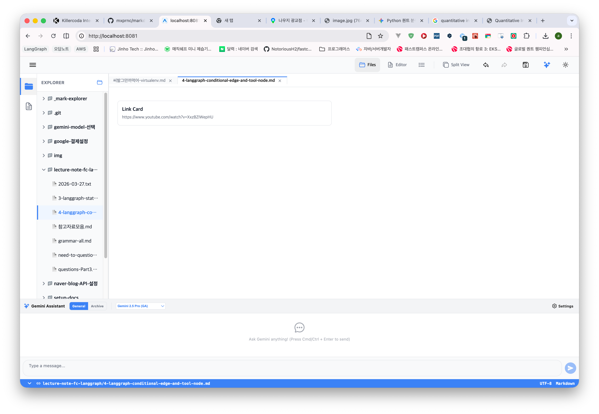

## 증상

 

Editor 모드에서 링크에 대해 Card Type 을 선택 후 제목을 입력하지 않고 저장했을 경우 Explorer 모드에서는 위의 그림과 같이 'Link Card'라는 문자열이 표기되는데, 제목을 입력하지 않으면 그냥 공백으로 표현되도록 해주세요.

이 요구사항을 풀기 위한 prompt 를 바로 아래의 ## 프롬프트에 작성해주세요. 현재 ## 증상 내의 내용들은 수정하거나 삭제하지 마세요.

## 프롬프트

### 제목: 익스플로러(미리보기) 모드 링크 카드 제목 부재 시 기본 텍스트 제거

**목표**: 익스플로러(미리보기) 모드에서 링크 카드(LinkCard)를 렌더링할 때, 제목(Alt Text)이 비어 있는 경우 'Link Card'라는 시스템 기본 텍스트가 표시되지 않도록 수정합니다.

**요구사항**:

1.  **MarkdownPreview.web.tsx (a 태그 매퍼) 수정**:
    *   `components` 객체 내부의 `a` 태그 렌더러를 찾으세요.
    *   `mx-thumb` 또는 `mx-video` 패턴을 처리하는 로직에서 제목(`alt`) 변수가 비어 있을 때 사용되는 폴백(Fallback) 문자열 `'Link Card'`를 제거하세요.
    *   `{alt || 'Link Card'}`와 같은 코드를 `{alt}` 또는 `{alt || ''}`로 변경하여, 제목이 없을 때는 아무것도 출력되지 않게 하세요.

2.  **데이터 일관성 확인**:
    *   에디터 모드(`LinkCardComponent.tsx`)에서 수정한 내용과 일치하도록 미리보기 모드의 렌더링 로직도 동일한 규칙을 적용하세요.

**검증 방법**:
- 에디터에서 링크 카드 생성 후 제목을 비워둔 채로 저장합니다.
- 익스플로러 모드(미리보기)로 전환합니다.
- 결과: 미리보기 화면의 링크 카드 UI에서 'Link Card'라는 텍스트가 보이지 않고, 제목 영역이 비어 있거나 해당 라인이 사라져야 합니다.
