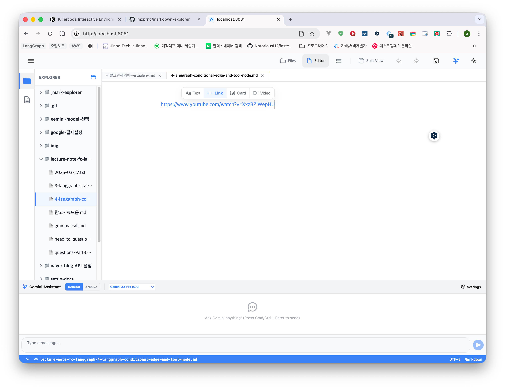

위 그림과 같은 UI 가 나타나는데, 여기서 뭘 누르면 '편집'을 할수 있을까요? 

아래 그림들을 참고하세요.
- (1)  
- (2) 

http, https 에 대한 링크노드가 Link Type 일 경우에 첨부한 그림과 같은 노션의 Link 추가 기능과 유사한 기능을 추가하려고 합니다. 첫번째 사진은 Link Node 로 인식되어 있는 상태에서 마우스 오버시의 동작입니다. 두번째 사진은 편집 버튼을 클릭했을 때의 동작입니다.

이 기능들을 구현작업을 진행하세요. 구현 계획과 목표를 docs/plan/link-thumbnail-card/PLAN3.md, docs/plan/link-thumbnail-card/GOAL3.md 에 정의하고, 진행상황이나 결과를 업데이트하세요.

