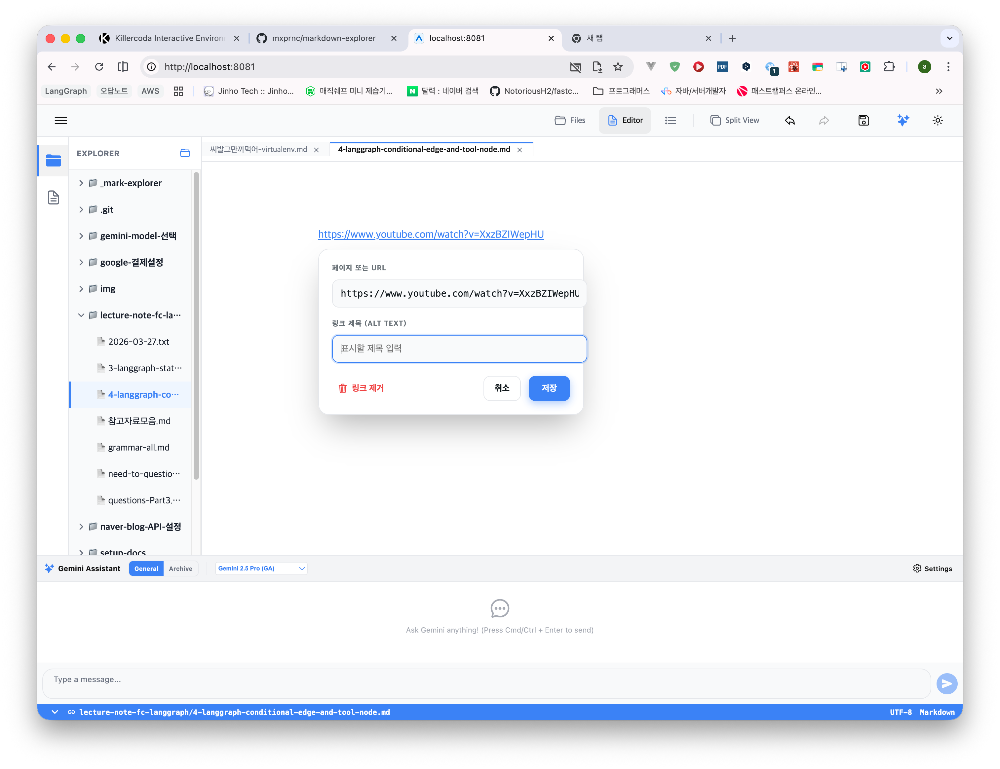
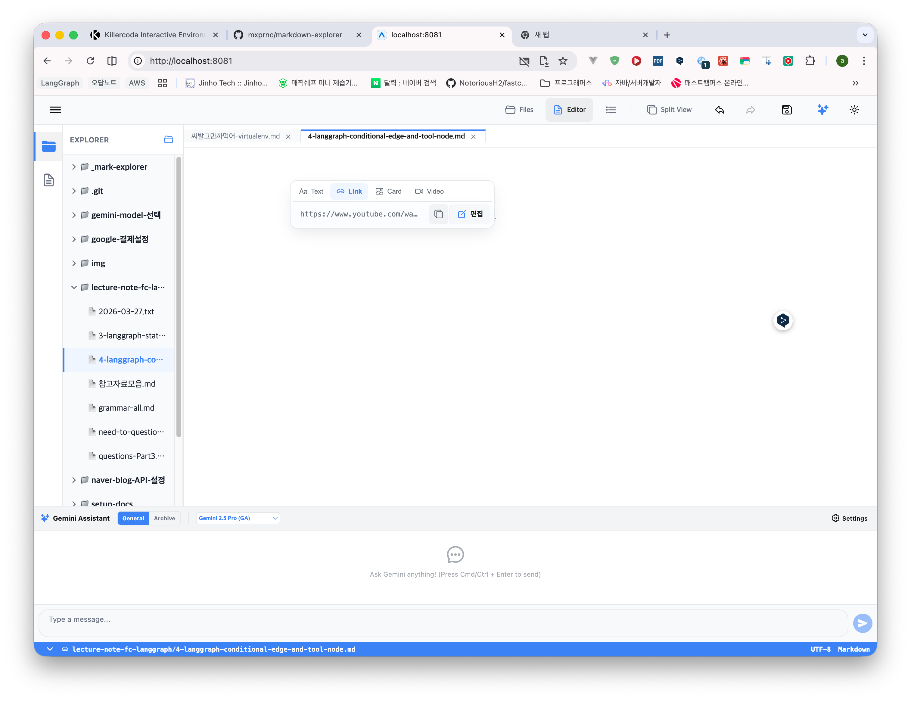
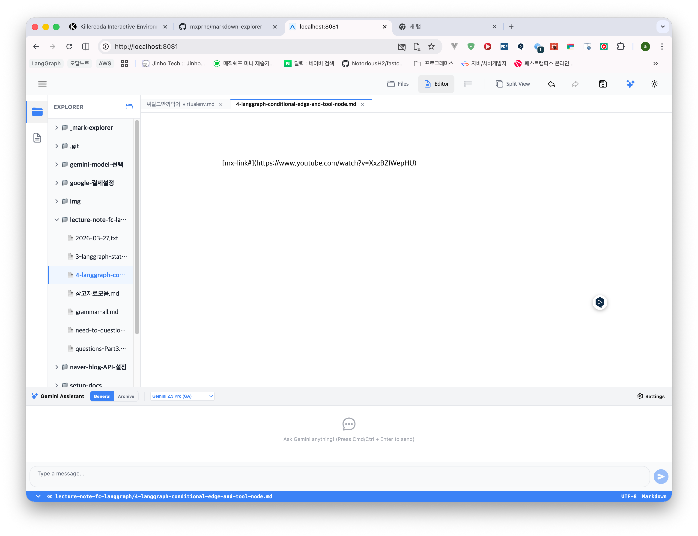

## (1) 

인풋 요소가 넘쳐나는 증상 해결 필요

## (2)

링크 복사 버튼이 동작하지 않습니다.

## (3)

편집 버튼이 어떤때는 동작하지만 어떤때는 동작하지 않습니다.

## (4)

링크의 끝에 커서를 둔 후에 엔터를 칠 경우에만 링크 노드로 변환되어 편집이 가능합니다.
이렇게 텍스트로 정의되어 있는 상태를 보여주는 노드 상태에서도 복사/편집 버튼의 동작이 필요하지 않을까요?
