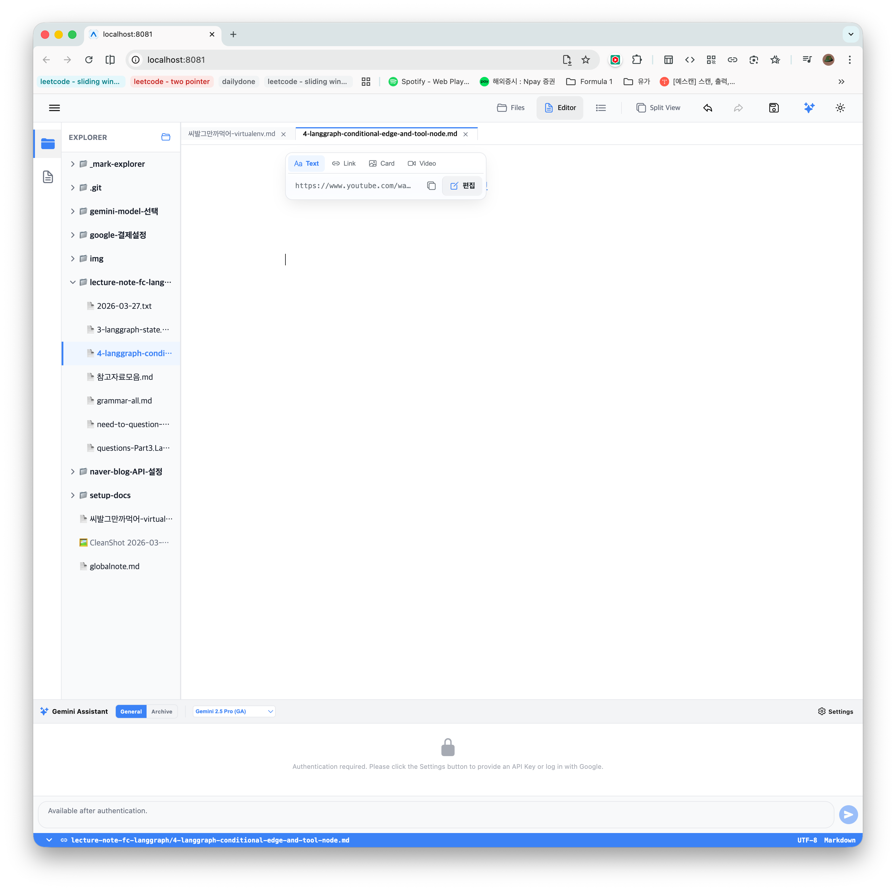

## (1) 편집 팝업의 타입별 입력 필드 최적화
현재 `Text` 타입이 선택되어 있을 때도 '링크 제목(Alt Text)' 입력 필드가 나타나는데, `Text` 모드에서는 실제 에디터에 제목이 반영되지 않아 사용자에게 혼란을 줄 수 있습니다.

**요구사항:**
- 편집 팝업 내의 입력 필드를 현재 노드 `type`에 따라 동적으로 구성하세요.
- `type === 'plain'` (Text) 일 경우:
    - '링크 제목 (Alt Text)' 입력 필드를 숨깁니다.
    - URL 입력 필드만 노출하여 '텍스트 그대로의 URL'을 수정한다는 의도를 명확히 합니다.
- `type === 'link'` (Link) 또는 `type === 'thumb'` (Card) 일 경우:
    - URL과 '링크 제목' 필드를 모두 노출합니다.
- `type === 'video'` 일 경우:
    - 비디오 URL 필드만 노출하거나, 필요에 따라 제목 필드를 유지합니다.

이와 같이 수정하여 사용자가 현재 선택한 모드에서 실제로 영향을 주는 데이터만 편집할 수 있도록 UI를 개선하세요.

