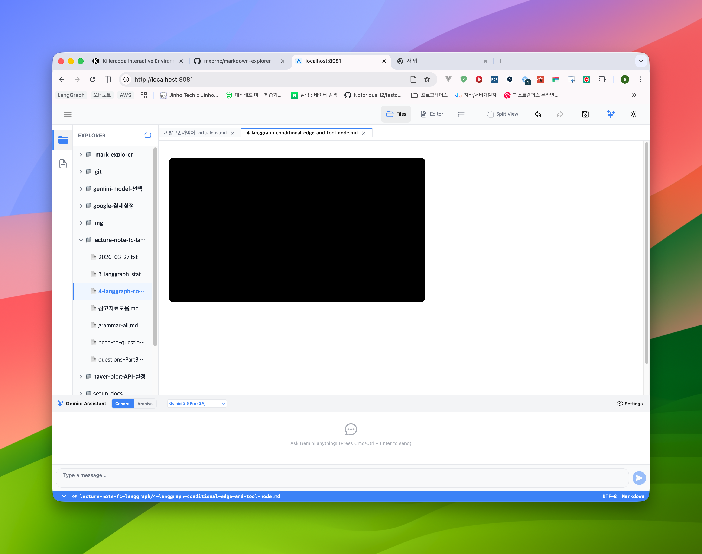

## (1) Video 타입의 깜빡임 증상 및 호버 안정성 개선
Video 타입으로 전환하거나 저장했을 때 화면이 깜빡이거나 툴바가 불안정하게 나타나는 문제를 해결해야 합니다.

**원인 분석 및 요구사항:**
- **Iframe 재랜더링 방지**: `updateAttributes` 호출 시 컴포넌트가 재랜더링되면서 `iframe`이 새로 고침되어 깜빡임이 발생할 수 있습니다. 비디오 플레이어 부분을 메모이제이션(`React.memo`)하거나 stable한 `key`를 사용하여 불필요한 재로드를 방지하세요.
- **호버 브릿지 및 상호작용 개선**: 비디오 플레이어(Iframe) 영역으로 마우스가 진입할 때 호버 상태가 유실되어 툴바가 깜빡이는 현상을 방지해야 합니다. 툴바와 비디오 영역 사이의 마우스 이동이 부드럽게 감지되도록 호버 브릿지(Hover Bridge)를 강화하세요.
- **레이아웃 안정화**: 비디오 로딩 전후의 레이아웃 변화로 인한 깜빡임을 최소화하기 위해 컨테이너에 고정된 `aspect-ratio`와 최소 높이를 확보하세요.
- **상태 초기화 최적화**: 편집 완료(`handleEditSave`) 후 툴바와 팝업 상태가 전환되는 과정에서 발생하는 시각적 노이즈를 제거하세요.

이 문제들을 해결하여 Video 모드에서도 다른 모드와 마찬가지로 부드럽고 프리미엄한 사용자 경험을 제공하도록 수정하세요.
