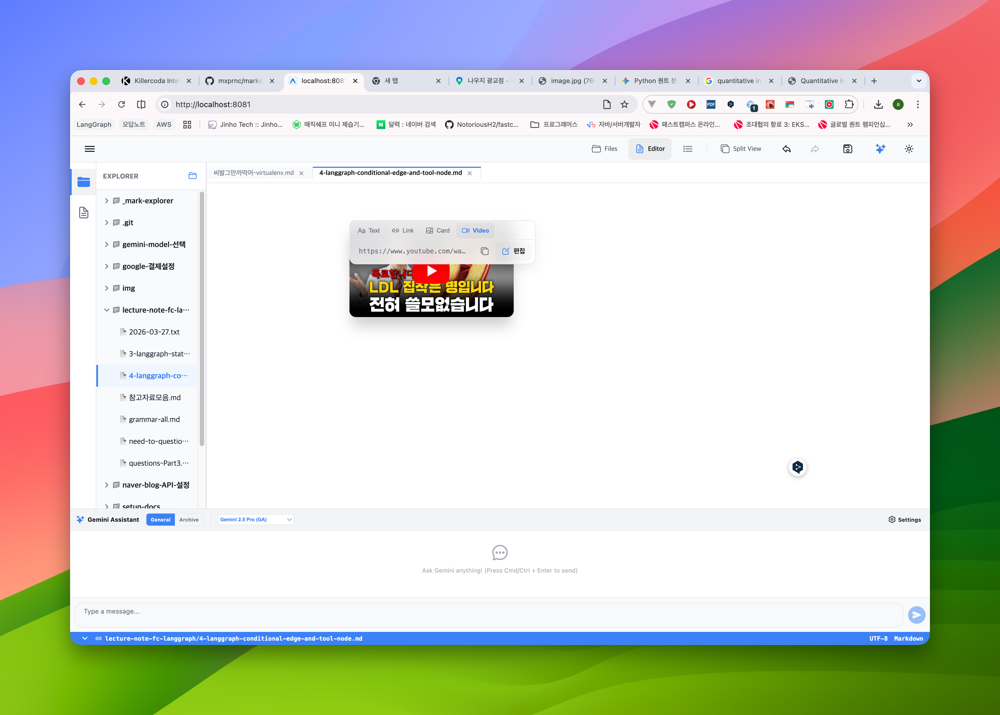
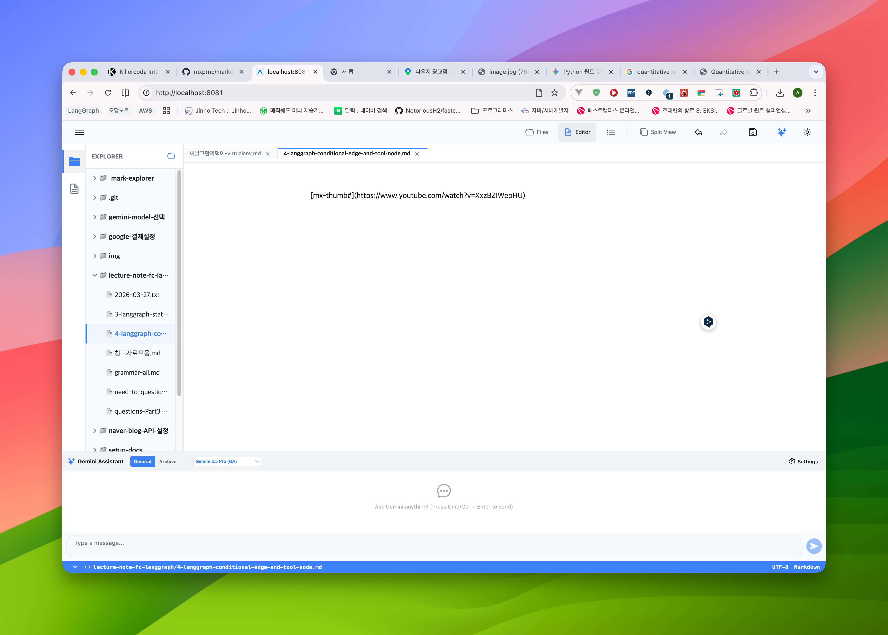

## 증상
위의 그림처럼 Video Type 일때 

다음 그림처럼 Card Type 으로 바꾸고나면 텍스트로 변하는데, 이것은 에러가 아니라 정상이긴 합니다.

그런데 여기서 다시 UI 로 바뀌도록 하기 위해 커서를 위 또는 아래로 이동시켜서 클릭해서 해당 영역에서 포커스가 벗어나게 해도 UI로 변하지 않습니다.

다른 Type 으로 변경시 커서를 다른 곳에 위치시키면 해당 Type 의 UI로 표현되도록 수정해주세요.
현재 이 증상을 기술한 내용은 삭제하거나 수정하지 말고, 추가로 작성해야 하는 내용은 아래에서부터 작성해주시면 됩니다.

## 프롬프트

### 제목: 링크 카드 타입 변경 시 UI 모드 복구 및 변환 로직 강화

**목표**: 에디터에서 링크 카드(LinkCard)의 타입을 변경하거나 마크다운 텍스트를 수동으로 수정했을 때, 커서가 해당 영역을 벗어나면 즉시 UI 카드로 다시 변환되도록 `LiveMarkdownExtension`의 로직을 수정합니다.

**요구사항**:

1.  **정규식(mxRegex) 강화**:
    *   `[mx-thumb#alt](url)` 패턴에서 `#` 기호가 없거나 `alt` 텍스트가 비어 있는 경우에도 유연하게 매칭되도록 정규식을 개선하세요. (예: `/\[mx-(thumb|link|video|plain)#?([^\]]*)\]\(([^)]+)\)/g`)
    *   `plain` 타입을 명시적으로 지원하여 일반 URL과 `mx-` 패턴이 겹치지 않게 하세요.

2.  **LiveMarkdownExtension (collapseText) 수정**:
    *   텍스트 블록 내에서 패턴의 위치(`start`, `end`)를 계산할 때, 블록 내부의 다른 노드(이미지 등)로 인한 인덱스 밀림 현상이 발생하지 않도록 절대 좌표 계산 방식을 정교화하세요.
    *   `nodeAt(start)` 방식 대신 `nodesBetween`을 사용하여 해당 범위에 이미 `linkCard` 노드가 생성되어 있는지 정확하게 감지하세요.
    *   커서가 해당 텍스트 범위(`[start, end]`)를 완전히 벗어난 상태(`!isTouching`)일 때만 노드 변환(`replaceWith`)이 일어나도록 보장하세요.

3.  **UI 상호작용 연동**:
    *   링크 카드의 팝업 메뉴에서 타입을 변경(`updateAttributes`)했을 때, 에디터의 `appendTransaction`이 이 변화를 감지하고 커서 위치에 따라 즉시 텍스트 확장 또는 노드 축소를 수행할 수 있도록 트랜잭션 메타데이터 처리를 확인하세요.

4.  **MarkdownUtils 동기화**:
    *   `preprocessMarkdown`과 `postprocessMarkdown` 함수에 정의된 정규식도 에디터와 동일하게 업데이트하여 파일 저장 및 로드 시에도 동일한 규칙이 적용되게 하세요.

**검증 방법**:
- 비디오 카드를 클릭하여 텍스트 모드로 진입합니다.
- 텍스트 내의 `video`를 `thumb`으로 변경합니다.
- 에디터의 다른 줄(위 또는 아래)을 클릭하여 포커스를 이동합니다.
- 결과: 텍스트가 즉시 썸네일 카드 UI로 변환되어야 합니다.
