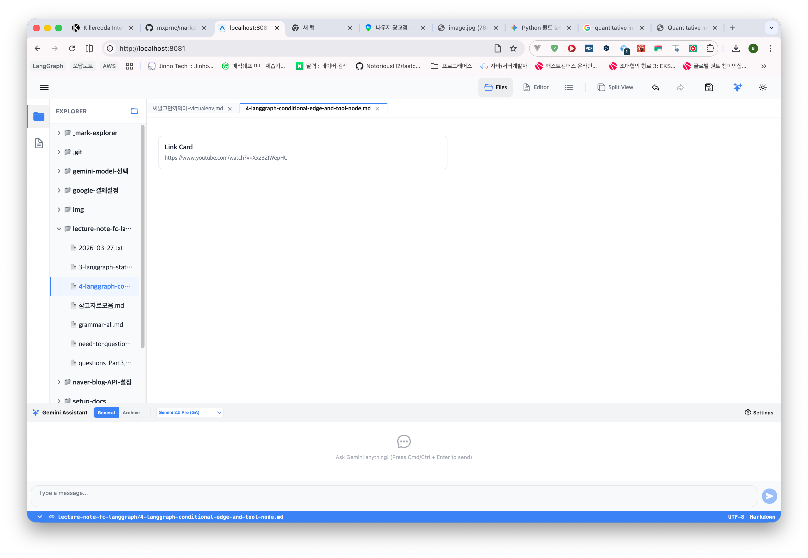

## 증상

Editor 모드에서 링크에 대해 Card Type 을 선택 후 제목을 입력하지 않았을 경우 위의 그림과 같이 'Link Card'라는 문자열이 표기되는데, 제목을 입력하지 않으면 그냥 공백으로 표현되도록 해주세요.

이 요구사항을 풀기 위한 prompt 를 바로 아래의 ## 프롬프트에 작성해주세요. 현재 ## 증상 내의 내용들은 수정하거나 삭제하지 마세요.

## 프롬프트

### 제목: 링크 카드 제목 부재 시 기본 텍스트 제거 및 공백 처리

**목표**: 에디터에서 링크 카드(LinkCard)를 생성하거나 편집할 때, 사용자가 제목(Alt Text)을 입력하지 않은 경우 'YouTube Video' 또는 기타 기본 플레이스홀더 텍스트가 표시되지 않도록 수정합니다.

**요구사항**:

1.  **LinkCardComponent.tsx (getDerivedMetadata) 수정**:
    *   `type === 'thumb'` 또는 `type === 'video'`일 때 실행되는 메타데이터 추출 로직을 수정하세요.
    *   `title` 속성의 폴백(Fallback) 값으로 지정된 `'YouTube Video'` 또는 `url`의 도메인 주소 등을 제거하고, `alt || ''`와 같이 빈 문자열을 기본값으로 설정하세요.
    *   `siteName` 또한 URL에서 도메인을 추출할 수 없는 경우 빈 문자열로 처리하여 레이아웃이 깔끔하게 유지되도록 하세요.

2.  **UI 렌더링 최적화**:
    *   제목(`metadata.title`)이 빈 문자열인 경우, 해당 텍스트 영역이 불필요한 여백을 차지하지 않도록 조건부 렌더링을 확인하세요. (예: `{metadata.title ? ... : null}`)

**검증 방법**:
- 새로운 유튜브 링크 또는 일반 웹 링크를 입력하여 카드를 생성합니다.
- '편집' 메뉴로 진입하여 제목(Alt Text)을 모두 지우고 '저장'을 클릭합니다.
- 결과: 카드 UI에서 제목 영역이 사라지거나 빈 공백으로 노출되어야 하며, 'YouTube Video' 같은 시스템 기본 텍스트가 보이지 않아야 합니다.
