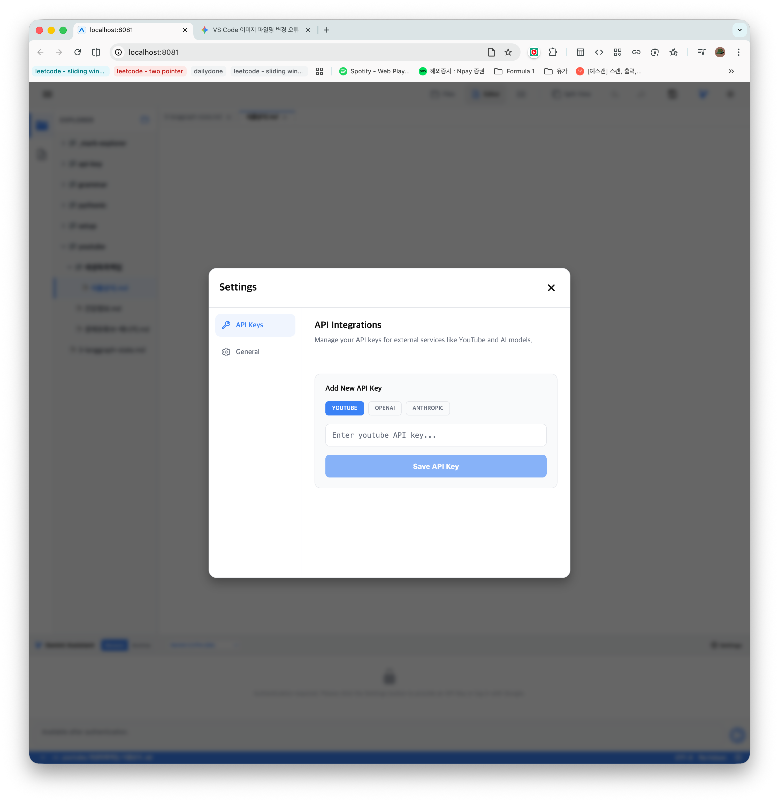

## Idea 1
https://www.youtube.com/playlist?list=PLAxO_AJSZsEhOK0r36AvSoEtr911_r14U 와 공개설정된 재생목록이 있습니다.

에디터모드에서 열려있는 마크다운 파일의 에디터 영역 내에 원하는 영역에 커서를 둔 후 마우스 우클릭 후 컨텍스트 메뉴에 'Extract Youtube playlist' 를 클릭하면 다이얼로그가 나타나며 Text | URL | Card | Video 네가지 모드를 선택할 수 있습니다. 다이얼로그에는 영상의 제목, 영상의 링크, 채널명, 채널명 displayname, Batch Size 가 함께 표현되어야 하며, 영상의 제목은 사용자가 수정할수 있습니다. Batch Size 는 기본값은 20 으로 하며, 사용자가 이 곳에 최대로 지정할수 있는 값은 50으로 제한합니다. 다이얼로그에서는 부가적인 정보로 좋아요 수, 시청수를 표기할지를 선택할 수 있습니다.

다이얼로그 내에 OK 버튼을 누르면 Youtube Data API v3 를 호출해서 해당 재생목록의 각 아이템들을 리스트로 표현하며, 영상제목, 영상링크(링크노드) 의 리스트로 표현되어야 합니다. 

전반적인 색상 조합이나 UI 스타일은 마크다운 엑스플로러 프로젝트의 디자인 철학을 따릅니다. 

이 내용을 만들기 위한 프롬프트를 바로 아래의 '### 프롬프트'에 작성하세요. 위의 내용은 삭제하거나 수정하지 마세요.

### 프롬프트

**Task**: Mark Explorer 프로젝트의 에디터 내에 'YouTube Playlist Extractor' 기능을 구현하세요.

**1. 개요 및 트리거**
- `components/Editor.web.tsx` (Tiptap 기반) 에디터 영역에서 마우스 우클릭 시 나타나는 컨텍스트 메뉴에 'Extract Youtube playlist' 항목을 추가하세요.
- 이 항목을 클릭하면 `YoutubeExtractorModal`이 나타나야 합니다.

**2. UI/UX 디자인 (YoutubeExtractorModal)**
- **디자인 철학**: 프로젝트의 'Premium & Modern' 디자인 시스템을 따릅니다. `components/explorer/RenameModal.tsx`의 구조를 참고하되, 더 세련된 UI를 적용하세요.
- **테마 지원**: `useTheme` 훅을 사용하여 `colors.surface`, `colors.border`, `colors.text` 등을 반영하고 다크/라이트 모드에 완벽히 대응하세요.
- **레이아웃**:
    - **모드 선택**: 'Text', 'URL', 'Card', 'Video' 네 가지 모드를 선택할 수 있는 Segmented Control 또는 스타일리시한 탭 UI를 상단에 배치하세요.
    - **입력 필드**: 
        - Playlist URL 입력 필드 (상단에 배치).
        - 영상 제목 (사용자가 수정 가능하도록 프리뷰 형태로 제공).
        - 영상 링크 (Read-only).
        - 채널명 및 채널 Display Name.
        - **Batch Size**: 기본값 20, 최대 50으로 제한된 숫자 입력 필드.
    - **옵션 (토글/체크박스)**: '좋아요 수 표기', '시청수 표기' 여부를 선택할 수 있는 스위치 UI를 포함하세요.
    - **버튼**: 'OK' (추출 시작)와 'Cancel' 버튼을 우측 하단에 배치하세요.

**3. 기능 구현 로직**
- **YouTube API 연동**: `Youtube Data API v3`를 사용하여 재생목록의 아이템들을 가져옵니다. API 키는 환경 변수 또는 설정에서 가져오도록 구조화하세요.
- **데이터 파싱**: 선택된 모드에 따라 마크다운 형식을 생성합니다.
    - 예 (Text 모드): `1. [영상제목](영상링크)`
    - 옵션 선택 시: `1. [영상제목](영상링크) - 👍 1.2k | 👁️ 10k`
- **에디터 삽입**: 사용자가 클릭했던 커서 위치(Selection)에 생성된 마크다운 리스트를 `editor.commands.insertContent()`를 통해 삽입하세요.

**4. 기술적 요구사항**
- **React Native/Expo (Web)** 환경에 최적화된 코드를 작성하세요.
- **모듈화**: UI 컴포넌트(`YoutubeExtractorModal.tsx`)와 로직(YouTube API 통신부)을 분리하여 `components/editor/` 또는 `utils/` 폴더에 배치하세요.
- **에러 핸들링**: 잘못된 URL이나 API 호출 실패 시 사용자에게 Toast나 Alert으로 친절하게 알림을 표시하세요.

**5. 디자인 디테일**
- `Inter` 및 `JetBrains Mono` 폰트를 적재적소에 사용하세요.
- 모달 배경에 미세한 블러 효과(Backdrop filter)나 부드러운 그림자(Shadow)를 추가하여 프리미엄한 느낌을 강조하세요.
- 버튼 호버 시 미세한 애니메이션 효과를 추가하세요.

## Idea 2: Settings integration and API Key Management
### 원본

이 곳에 해당 아이디어와 프롬프트를 작성해주세요. 제안1과 제안2를 결합한 방식을 사용하겠습니다. 현재 API Keys 에 저장된 Youtube Data API 에 대한 API Key 가 없을 경우에는 공백으로 표시하고,  API Keys 내에 API Key 가 있을 경우에는 Extract Youtube playlist 다이얼로그 내의  표기하는 방식으로 해주세요.

Extract Youtube playlist 다이얼로그에는 Youtube Data API Key 의 첫 5글자와 마지막 3글자 외에는 마스킹처리해주세요. 

API Keys 모달에 표시되는 각각의 API Key 들에 대해서는 각각 {API 종류}: {값} {복사버튼} 으로 표시하고 {값} 표기시에는 첫 5글자와 마지막 3글자 외에는 마스킹처리해주세요.

이 내용들에 대한 제안, 프롬프트를 작성한후 개발을 진행하세요.

### Gemini
전역 설정 모달과 YouTube 추출 다이얼로그를 유기적으로 연결하여 API Key를 안전하고 편리하게 관리합니다.

#### 구현 요구사항
1. **API Keys 전역 설정 모달**:
    - 앱의 푸터 또는 사이드바에 'Settings' 버튼을 추가하고, 클릭 시 'API Keys' 탭이 포함된 모달을 띄웁니다.
    - 각 API Key 항목은 `{API 종류}: {마스킹된 값} {복사 버튼} {삭제 버튼}` 형식으로 표시합니다.
    - **마스킹 규칙**: 첫 5글자와 마지막 3글자만 노출하고 나머지는 `*`로 처리합니다. (예: `AIzaS*****XYZ`)
    - 새로운 API Key를 입력하고 저장할 수 있는 입력 필드와 'Save' 버튼을 제공합니다.
    - 설정 값은 로컬 스토리지(`AsyncStorage` 또는 `IndexedDB`)에 영구 저장되어야 합니다.

2. **Youtube Extractor 다이얼로그 연동**:
    - 다이얼로그 하단 또는 상단에 현재 설정된 YouTube API Key의 마스킹된 상태를 표시합니다.
    - 만약 API Key가 저장되어 있지 않다면 "API Key가 설정되지 않았습니다."라는 메시지와 함께 **[설정으로 이동]** 버튼/링크를 표시합니다.
    - 이 버튼을 클릭하면 전역 설정 모달의 'API Keys' 탭이 즉시 열려야 합니다.

3. **데이터 보안 및 편의성**:
    - API Key 복사 버튼 클릭 시 클립보드에 원본 값이 복사되도록 구현합니다.
    - `YoutubeUtils.ts`는 환경 변수(`process.env`)보다 로컬 스토리지에 저장된 사용자 API Key를 우선적으로 사용하도록 수정합니다.

#### 프롬프트
**Task**: Mark Explorer 내부에 전역 설정 시스템을 구축하고 YouTube API Key 관리 기능을 구현하세요.

1. **상태 관리 및 저장소**:
    - `contexts/SettingsContext.tsx`를 생성하여 API Key(YouTube 등)를 전역 상태로 관리하세요.
    - `AsyncStorage` 또는 `IndexedDB`를 사용하여 앱 재시작 후에도 설정이 유지되도록 하세요.

2. **UI 컴포넌트 구현**:
    - `components/settings/SettingsModal.tsx`: 'API Keys' 탭을 포함한 프리미엄 디자인의 설정 모달을 만드세요.
    - 마스킹 로직(`maskKey` 유틸리티)을 구현하여 화면에는 보안 처리된 값만 노출하세요.
    - 각 항목 옆에 `Ionicons`를 사용한 복사/삭제 버튼을 배치하세요.

3. **기능 연결**:
    - `app/index.tsx`에 `SettingsModal`을 통합하고 푸터의 설정 버튼과 연결하세요.
    - `YoutubeExtractorModal.tsx`를 수정하여:
        - 설정된 키가 있으면 마스킹된 상태로 표시.
        - 키가 없으면 경고 메시지와 함께 `SettingsModal`을 열 수 있는 링크 제공.
    - `utils/YoutubeUtils.ts`가 전역 설정의 키를 사용하도록 인터페이스를 조정하세요.

4. **디자인 가이드**:
    - `useTheme`를 사용하여 일관된 다크/라이트 모드를 지원하세요.
    - 모달은 `BackdropBlur` 효과와 부드러운 전환 애니메이션을 적용하여 고급스러운 느낌을 주어야 합니다.

## Idea 3: API Keys 목록 수정 기능 개선
### 원본

API Keys 내에는 다음과 같이 목록으로 표시하고, 스크롤이 가능하도록 하세요.

{API 종류 1} : {값} {수정 아이콘} {삭제 아이콘} 
{API 종류 2} : {값} {수정 아이콘} {삭제 아이콘} 
{API 종류 3} : {값} {수정 아이콘} {삭제 아이콘} 
{API 종류 4} : {값} {수정 아이콘} {삭제 아이콘} 
{API 종류 5} : {값} {수정 아이콘} {삭제 아이콘} 

{+ API Key 추가} 버튼

### Gemini
#### 프롬프트
**Task**: `SettingsModal.tsx`의 API Keys 목록 UI를 개선하고 수정 기능을 추가하세요.

1. **목록 UI 개선**:
    - API Key 목록을 `{API 종류} : {마스킹된 값} {수정 아이콘} {삭제 아이콘}` 형식으로 가독성 있게 배치하세요.
    - 목록 영역에 `ScrollView`를 적용하여 항목이 많아질 경우 스크롤이 가능하도록 하세요.
    - 각 항목의 배경색과 테두리를 `useTheme`의 컬러 토큰을 사용하여 세련되게 디자인하세요.

2. **수정 및 추가 기능**:
    - **수정 아이콘**: 기존 키 옆에 `Ionicons`의 `create-outline` 아이콘을 배치하고, 클릭 시 해당 키 정보가 입력 폼에 자동으로 채워지도록 하세요.
    - **추가 버튼**: 기존의 항상 노출되던 입력 폼을 숨기고, 목록 하단에 `{+ API Key 추가}` 버튼을 배치하세요.
    - 버튼 클릭 시에만 입력 폼(`selectedType`, `inputKey`)이 나타나도록 구현하여 공간을 효율적으로 사용하세요.

3. **인터랙션 및 사용자 경험**:
    - 키 저장 후에는 입력 폼이 다시 닫히고 목록이 업데이트되도록 하세요.
    - `Ionicons` 아이콘 클릭 시 미세한 피드백(Opacity 변화 등)을 주어 프리미엄한 느낌을 유지하세요.
